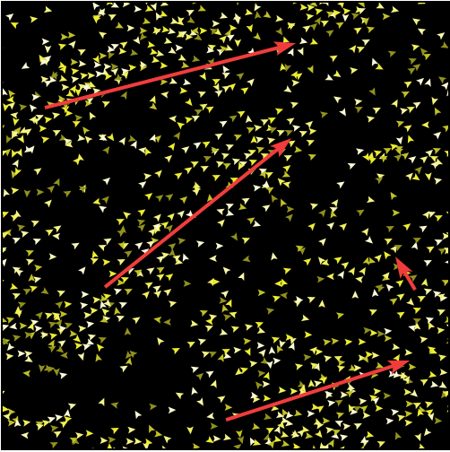
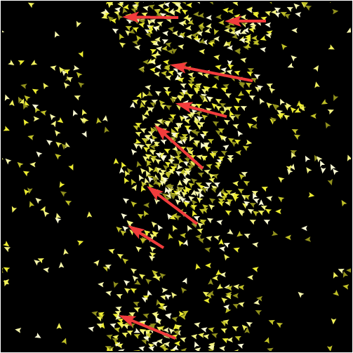
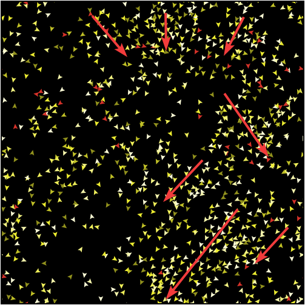
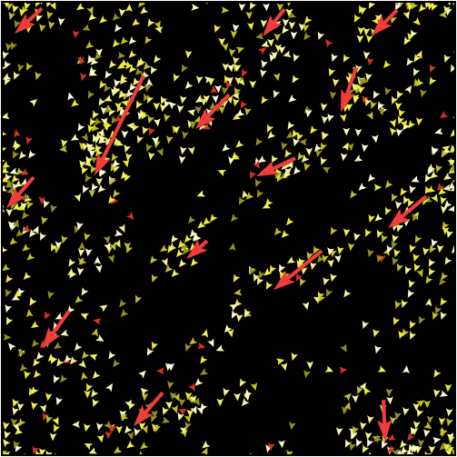

## Комп'ютерні системи імітаційного моделювання
## СПм-24-2, **Бондаренко Сергій Вікторович**
### Індивідуальне Домашнє Завдання. Редагування імітаційних моделей у середовищі NetLogo

---
### Варіант моделі у середовищі NetLogo:
[Flocking](https://www.netlogoweb.org/launch#https://www.netlogoweb.org/assets/modelslib/Sample%20Models/Biology/Flocking.nlogox). Модель імітації рухів зграй птахів.
- Додати обмежену видимість птахів у вигляді конуса перед ними, щоб взаємодія відбувалась лише з агентами в полі зору, а не з усіма навколо.
- Додати індивідуальні характеристики птахів (досвід, швидкість реакції та витривалість), які впливають на точність вирівнювання, швидкість руху та стабільність поведінки в зграї.
- Додати затримку реакції птаха на рух сусідів, щоб він змінював напрям не миттєво, а з часовим запізненням.
- Додати залежність сили правил зграйності (cohesion, separation, alignment) від локальної щільності птахів навколо агента.
- Додати розподіл ролей на лідерів і звичайних птахів, де лідери менш схильні до вирівнювання та задають загальний напрям руху.

---
### Внесені зміни у вихідну логіку моделі:
#### Додано обмежену видимість птахів у вигляді конуса перед ними, щоб взаємодія відбувалась лише з агентами в полі зору, а не з усіма навколо.
Спершу було створено глобальну змінну кута огляду у градусах.
```
globals [
  vision-angle   ;; половина кута огляду (в градусах)
]
```

Далі у процедурі `setup` зроблено ініціалізацію змінної.
```
set vision-angle 60
```

І повністю переписано процедуру `find-flockmates` з урахуванням нових параметрів видимості птахів.
```
to find-flockmates  ;; turtle procedure
  let candidates other turtles in-radius vision
  set flockmates candidates with [
    abs (subtract-headings
          [heading] of myself
          towards myself) <= vision-angle
  ]
end
```
Де:
- `towards myself` — напрямок **від мене до іншого птаха**
- `subtract-headings` — різниця між напрямком погляду і ціллю
- `vision-angle` — межа конуса

Такі зміни кута видимості, коли птахи бачать лише перед собою, призвели до значних ускладнень в утворенні зграй птахів. Тепер помітити виразні зграї птахів можна лише значно збільшивши саму кількість птахів на полі.
Якщо ж кут видимості збільшувати - утворення зграй поступово стає більш вираженим.

#### Додано індивідуальні характеристики птахів (досвід, швидкість реакції та витривалість), які впливають на точність вирівнювання, швидкість руху та стабільність поведінки в зграї.
У `turtles-own` додані усі необхідні характеристики, змінні, для кожної птиці.
```
turtles-own [
  flockmates
  nearest-neighbor

  experience              ;; досвід (0..1)
  base-reaction-speed     ;; базова швидкість реакції
  stamina                 ;; поточна стаміна
  max-stamina             ;; індивідуальний максимум
  stamina-threshold       ;; поріг для відновлення
  recovering?             ;; чи відновлюється зараз
  recovery-delay          ;; затримка перед відновленням
  waiting-for-recovery?   ;; чекає початку відновлення
]
```

Досвід впливає на можливість птахів тримати напрям. Швидкість реакції впливає на силу вирівнювання (alignment), а stamina швидкість руху птаха. Тобто, зі зменшенням stamina птахи поступово уповільнюються, а з відновленням повертаються до нормальної швидкості руху.

Ініціалізація характеристик відбувається у `setup`, **всередині** `create-turtles`.
```
set experience random-float 1.0
set base-reaction-speed 0.6 + random-float 0.4

set max-stamina 5 + random-float 5
set stamina max-stamina
set stamina-threshold max-stamina * (0.3 + random-float 0.2)

set recovering? false
set waiting-for-recovery? false
set recovery-delay 0
```

Фактичну реальну швидкість реакції описує формула *reaction-speed = base-reaction-speed × (stamina / max-stamina)*. Тому було змінено процедуру `align`. Було:
```
to align  ;; turtle procedure
  turn-towards average-flockmate-heading max-align-turn
end
```

Стало:
```
to align  ;; turtle procedure
  let reaction-speed base-reaction-speed * (stamina / max-stamina)
  turn-towards average-flockmate-heading (max-align-turn * experience * reaction-speed)
end
```

Логіка витрат та відновлення стаміни була реалізована у процедурі `go`. Відновлення стаміни починається не миттєво та для кожного птаха воно відбувається у різний момент часу, що призводить до легкого дисбалансу у зграях.
```
to go  
  ask turtles [ flock ]  
  ;; the following line is used to make the turtles  
  ;; animate more smoothly.  
  repeat 5 [ ask turtles [ fd 0.2 ] display ]  
  ;; for greater efficiency, at the expense of smooth  
  ;; animation, substitute the following line instead:  
  ;;   ask turtles [ fd 1 ]  
    
  ask turtles [  
    ;; витрата стаміни  
    if not recovering? [  
      set stamina max list 0 (stamina - 0.01)  
    ]  
  
    ;; перехід у стан очікування відновлення  
    if (stamina < stamina-threshold)  
       and not recovering?  
       and not waiting-for-recovery? [  
      set waiting-for-recovery? true  
      set recovery-delay random 50 + 10  
    ]  
  
    ;; відлік затримки  
    if waiting-for-recovery? [  
      set recovery-delay recovery-delay - 1  
      if recovery-delay <= 0 [  
        set waiting-for-recovery? false  
        set recovering? true  
      ]  
    ]  
  
    ;; відновлення  
    if recovering? [  
      set stamina min list max-stamina (stamina + 0.02)  
      if stamina >= max-stamina [  
        set recovering? false  
      ]  
    ]  
      
    ;; DEBUG  
    ;; set label precision stamina 2  
  ]  
  tick  
end
```

Результатом того, що кожен птах стає унікальним - з'являються ще більше природних флуктуацій зграї без хаосу, що ще більше ускладнило утворення зграй.

#### Додано затримку реакції птаха на рух сусідів, щоб він змінював напрям не миттєво, а з часовим запізненням.
Затримка затримка реакції птаха на рух сусідів - це **памʼять сприйняття**, а не моторики. Це дві різні біологічні речі, які не суперечать одна одній. Тому така затримка, коли птах бачить сусіда зараз, а реагує на нього лише через декілька тактів буде цілком природною.

Для реалізації цього механізму у `turtles-own` додано змінні пам'яті:
```
  remembered-heading      ;; запамʼятований середній напрям
  reaction-delay          ;; індивідуальна затримка (в тіках)
```

Які ініціалізовано у `setup`:
```
set remembered-heading heading
set reaction-delay 1 + random 3
```

Саме запам'ятовування напряму сусідів реалізовано у процедурі `flock`, тому її було повністю переписано. Тепер рішення прийнмається на основі `remembered-heading`, але оновлюється не кожен тік.
```
to flock  ;; turtle procedure  
  find-flockmates  
  if any? flockmates [  
    if ticks mod reaction-delay = 0 [  
      set remembered-heading average-flockmate-heading  
    ]  
  
    find-nearest-neighbor  
    ifelse distance nearest-neighbor < minimum-separation  
    [ separate ]  
    [ align  
      cohere ]  
  ]  
end
```

Тепер треба змінити процедуру `align`, щоб вона використовувала пам'ять, додавши таку строку коду.
```
turn-towards remembered-heading (max-align-turn * experience * reaction-speed)
```

У результаті, затримка у пам'яті моторики та пам'яті сприйняття ніяк не конфліктують між собою. А хвилі запізнення сприйняття навіть значною мірою покращили процесс утворення зграй, зробив його більш плавним та помітним для ока.

#### Додано залежність сили правил зграйності (cohesion, separation, alignment) від локальної щільності птахів навколо агента.
Спочатку у `turtles-own` створимо змінну локальної щільності для кожного птаха, яка визначає кількість птахів поряд з агентом.
```
local-density           ;; локальна шільність зграї
```

Далі у процедурі `flock`, **після `find-flockmates`** додати ініціалізацію змінної
```
set local-density count flockmates
```

І у кінці треба переписати процедуру `separate`
```
to separate  ;; turtle procedure  
  let density-factor min list 2 (local-density / 5)  
  turn-away ([heading] of nearest-neighbor) (max-separate-turn * density-factor)  
end
```

та процедуру `cohere`, щоб вони ураховували щільність птахів навколо агенту.
```
to cohere  ;; turtle procedure  
  let density-factor max list 0.5 (1 - local-density / 10)  
  turn-towards average-heading-towards-flockmates (max-cohere-turn * density-factor)  
end
```

Процедуру `align`, яка відповідає за вирівнювання змінювати не треба, вона і так вже адаптивна та враховує досвід, стаміну та реакцію.

Залежність правила зграйності від щільності птахів навколо агента дозволяє поодиноким птахам краще збиватися у зграї, а великим зграям більш плавно розпадатися, що створює більш природні цикли.

#### Додано розподіл ролей на лідерів і звичайних птахів, де лідери менш схильні до вирівнювання та задають загальний напрям руху.
Спочатку створимо slider для визначення відсотку лідерів (0-50%) з такими параметрами:
- **Name:** `leaders-percent`
- **Minimum:** `0`
- **Maximum:** `50`
- **Increment:** `1`
- **Initial value:** `10`
- **Units:** `%`

І ініціалізація у `setup` всередині `create-turtles`
```
set leader? (random-float 100 < leaders-percent)
```

Також при ініціалізації було зроблено захист від крайніх випадків, щоб уникнути «всі — лідери» або «немає лідерів»:
```
if leaders-percent = 0 [
  set leader? false
]
```

Та визуальна перевірка, щоб одразу бачити лідерів зграї
```
if leader? [  
    set color red  
    set leader-heading heading  
]
```

На відміну від звичайних птахів, лідери мають власний напрям руху, який реалізовано у процедурі `lead`.
```
to lead  ;; turtle procedure
  if leader? [
    ;; повільна випадкова зміна курсу
    set leader-heading leader-heading + random-float 10 - 5
    turn-towards leader-heading 1
  ]
end
```

Для того, щоб звичайні птахи орієнтувалися на лідерів, у процедурі `flock`, одразу після **оновлення** `remembered-heading` і **до основної логіки зграйності, викликів** `align` **та** `cohere` було додано перевагу лідера. Щоб не перезаписувати перезаписувати heading, вплив лідерів зроблено більш м'яким.
```
 ;; Перевага лідерів  
    let nearby-leaders flockmates with [leader?]  
    if any? nearby-leaders [  
      set remembered-heading  
        (0.7 * remembered-heading +  
         0.3 * mean [leader-heading] of nearby-leaders)
    ]
```

Самі лідери заливаются у зграї, але вони менш схильні до вирівнювання та слабко тягнуться до інших, але командують. тому на самом початку процедури `flock` було створено виклик процедури `lead `, який корегую напрям руху лідерів, не виключаючи їх з зграйної логіки.
```
if leader? [
    lead
  ]
```

Для того, щоб послабити вирівнювання лідерів (але не вимикати) у процедуру `aling` додано цей код.
```
let leader-factor ifelse-value leader? [0.4] [1]  
turn-towards remembered-heading (max-align-turn * experience * reaction-speed * leader-factor)
```

Загалом лідерство було реалізовано у м’якій формі: лідери залишаються частиною зграї, але мають зменшену схильність до вирівнювання та слабко впливають на напрям руху сусідніх агентів, що забезпечує керованість без руйнування зграйної структури.

Фінальний код моделі та її інтерфейс доступні за [посиланням](Flocking_IDZ.nlogox).

## Обчислювальні експерименти
### 1. Вплив обмеженої видимість птахів, у вигляді конуса перед ними, на процесс утворення зграй
У данному дослідженні спостерігається вплив обмеження видимості птахів, у вигляді конусу перед ними, на процесс утворення зграй протягом певної кількості тактів (300). Експерименти проводяться базовій моделі та модифікованій без обмежень видимості та видимості конусом 120° перед птахом. Популяція птахів встановлена максимальна (1000), усі інші параметри за замовчуванням.

Базова модель:


Повна видимість модифікованої моделі:


Обмежена видимість модифікованої моделі:


Як можно побачити з рисунків, у базовій моделі утворюються чіткі зграї з мінімальним шумом, тобто рідкими птахами, які відбилися від зграї.
У модифікованій моделі з повною видимістю також залишаються декілька ключових зграй, але вже доволі багато птахів відбиваються від зграї, бо не можуть визначитися за ким їм летіти.
Коли видимість обмежується лише перед агентом, птахи стають більш схильними до формування більшої кількості маленьких зграй, які мають більш-менш спільну глобальну траєкторію руху. також стає набагато менше шуму.

З эксперименту можна зробити висновок, що зменшення видимості дуже гарно впливає на модель. Роблячи формування зграй більш природнім та сильно зменшує шум (поодиноких птахів).

### 2. Вплив наявності лідерів на процесс утворення зграй
У данному дослідженні спостерігається вплив наявності лідерів на процесс утворення зграй протягом певної кількості тактів (300). Експерименти проводяться на модифікованій без обмежень видимості та видимості конусом 120° перед птахом. Популяція птахів встановлена максимальна (1000), `leaders-percent` на *5%*, а усі інші параметри за замовчуванням.

Повна видимість:


Обмежена видимість:


При додаванні до зграй лідерів, з повною видимістю починає утворюватися більша кількість менших по розміру зграй та стає трохи менше шуму, але в загалом ситуація несильно змінилася.
З обмеженою видимістю же ситуація майже не змінилася, але утворилося дещо більше зграй, рух яких так само має спільну загальну тенденцію.

З эксперименту можна зробити висновок, що додавання лідерів до зграй дробить зграї на більш дрібні, зберігаючи усі інші особливості такими ж.
Навіть якщо зробити процент лідерів дуже великим (30%+), це лише зробить зграї більш розрідженими. їх кількість не сильно зменшиться, але вони будуть зливатися між собою. Також буде доволі багато лідерів, які поодиноко літають по полю.
