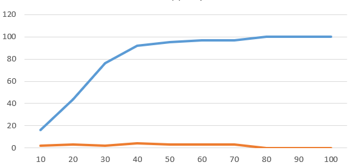
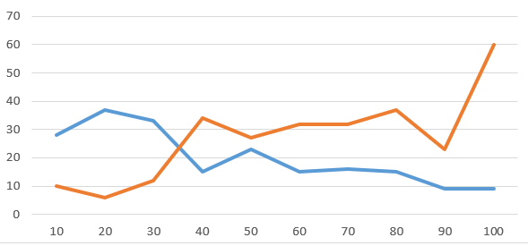
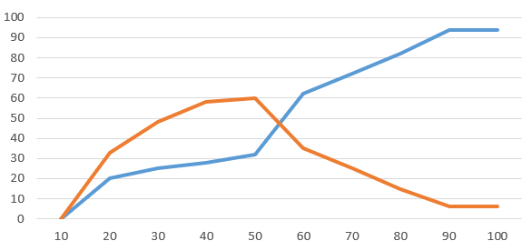

## Комп'ютерні системи імітаційного моделювання
## СПм-24-2, **Бондаренко Сергій Вікторович**
### Лабораторна робота №**1**. Опис імітаційних моделей та проведення обчислювальних експериментів

 

### Варіант 3, модель у середовищі NetLogo:
[Virus](https://www.netlogoweb.org/launch#https://www.netlogoweb.org/assets/modelslib/Sample%20Models/Biology/Virus.nlogo). Модель поширення захворювання у людській популяції.

 

### Вербальний опис моделі:

Ця модель імітує передачу та поширення вірусу в людській популяції. 
Модель ініціалізується зі 150 людьми, з яких 10 інфіковані. Люди випадковим чином переміщуються світом в одному з трьох станів: здорові, але схильні до інфекції (зелений), хворі та інфекційні (червоний) та здорові та імунні (сірий). Люди можуть померти від інфекції або старості. Коли чисельність популяції падає нижче «вантажопідйомності» середовища (встановленої на рівні 300 у цій моделі), здорові люди можуть мати здорове (але схильне) потомство.

### Керуючі параметри:
- **number-people** визначає початкову кількість людей у середовищі.
- **infectiousness** визначає ймовірність передачі вірусу, коли інфікована та сприйнятлива особи знаходяться в одній зоні.
- **duration** визначає кількість тижнів до того, як інфікована людина помре або одужає.
- **chance-recover** контролює ймовірність того, що інфекція завершиться одужанням/імунітетом.
- **turtle-shape** контролює візуалізацію людей як фігури людей чи кола.

### Внутрішні параметри:
- **sick**. Кількість інфікованих людей.
- **immune**. Кількість імунних людей.
- **healthy**. Кількість сприйнятливих людей.
- **total**. Кількість осіб у загальній популяції.

### Показники роботи системи:
- Сумма сприйнятливих, інфікованих та імунних людей на поточному такті симуляції не може перевищувати загальну.
- Кількості інфікованих та імунних людей зворотно пропорційні.
- **%infected** - відсоток інфікованого населення
- **%immune** - відсоток імунного населення.
- **years** - кількість років, що минули.

### Примітки:
При налаштуваннях керуючих параметрів за замовчуванням, кількість осіб у загальній популяції досягає максимуму (300 осіб) після 100 такту, після чого більше не змінюється.

### Недоліки моделі:
Невелика гнучкість налаштування. Не можна налаштувати пропускну спроможність світу (скільки людей може бути на планеті одночасно), середню тривалість життя людей та їх народжуваність. Немає повзунка регулюючого тривалість імунітету.

 

## Обчислювальні експерименти

### Вплив ймовірність передачі вірусу на відсоток інфікованого та імунного населення
Досліджується залежність відсотку інфікованого та імунного населення протягом певної кількості тактів (100) від ймовірність передачі вірусу, зазначеного на початку симуляції.
Експерименти проводяться при 10-100% ймовірності передачі вірусу, з кроком 10%, усього 10 симуляцій.
Інші керуючі параметри мають значення за замовчуванням:
- **number-people**: 150
- **chance-recover**: 75
- **duration**: 20

| infectiousness | %infected | %immune |
| -------------- | --------- | ------- |
| 10             | 16        | 2       |
| 20             | 44        | 3       |
| 30             | 76        | 2       |
| 40             | 92        | 4       |
| 50             | 95        | 3       |
| 60             | 97        | 3       |
| 70             | 97        | 3       |
| 80             | 100       | 0       |
| 90             | 100       | 0       |
| 100            | 100       | 0       |

Графік наочно показує, що збільшення ймовірності передачі вірусу, збільшується відсоток інфікованих людей, а відсоток імунних залишається низьким і поступову зменшується до нуля.

### Вплив ймовірність завершення інфекції одужанням/імунітетом на відсоток інфікованого та імунного населення
Досліджується залежність відсотку інфікованого та імунного населення протягом певної кількості тактів (100) від ймовірність завершення інфекції одужанням/імунітетом,  зазначеного на початку симуляції.
Експерименти проводяться при 10-100% ймовірності завершення інфекції одужанням/імунітетом, з кроком 10%, усього 10 симуляцій.
Інші керуючі параметри мають значення за замовчуванням:
- **number-people**: 150
- **infectiousness**: 65
- **duration**: 20

| chance-recover | %infected | %immune |
| -------------- | --------- | ------- |
| 10             | 28        | 10      |
| 20             | 37        | 6       |
| 30             | 33        | 12      |
| 40             | 15        | 34      |
| 50             | 23        | 27      |
| 60             | 15        | 32      |
| 70             | 16        | 32      |
| 80             | 15        | 37      |
| 90             | 9         | 23      |
| 100            | 9         | 60      |

Графік наочно показує, що збільшення ймовірності завершення інфекції одужанням/імунітетом поступово збільшує відсоток імунних людей, а відсоток інфікованих навпаки зменшує.

### Вплив тривалості життя вірусу на відсоток інфікованого та імунного населення
Досліджується залежність відсотку інфікованого та імунного населення протягом певної кількості тактів (100) від тривалості життя вірусу, зазначеного на початку симуляції.
Експерименти проводяться при 10-100 тривалості життя вірусу, з кроком 10, усього 10 симуляцій.
Інші керуючі параметри мають значення за замовчуванням:
- **number-people**: 150
- **infectiousness**: 65
- **chance-recover**: 75

| duration | %infected | %immune |
| -------------- | --------- | ------- |
| 10             | 0         | 0       |
| 20             | 20        | 33      |
| 30             | 25        | 48      |
| 40             | 28        | 58      |
| 50             | 32        | 60      |
| 60             | 62        | 35      |
| 70             | 72        | 25      |
| 80             | 82        | 15      |
| 90             | 94        | 6       |
| 100            | 94        | 6       |

Графік наочно показує, що збільшення тривалості життя вірусу спочатку збільшує відсоток інфікованих людей, поки відсоток імунних людей не почне зменшуватися.
