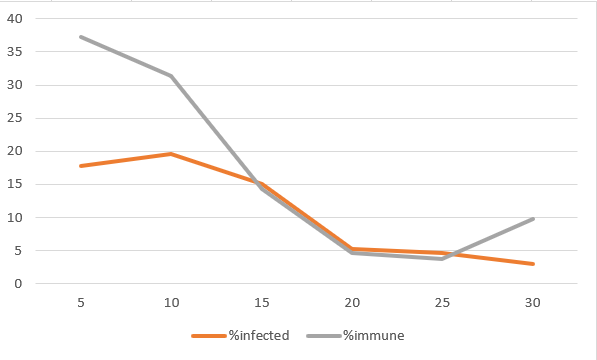

## Комп'ютерні системи імітаційного моделювання
## СПм-24-2, **Бондаренко Сергій Вікторович**
### Лабораторна робота №**1**. Опис імітаційних моделей та проведення обчислювальних експериментів

---

### Варіант 3, модель у середовищі NetLogo:
[Virus](https://www.netlogoweb.org/launch#https://www.netlogoweb.org/assets/modelslib/Sample%20Models/Biology/Virus.nlogo). Модель поширення захворювання у людській популяції.

---

### Внесені зміни у вихідну логіку моделі, за варіантом:

#### Додано вплив віку на інфікування та результат захворювання
У `turtles-own` додано параметр залежність ризику смерті від віку.
```
mortality-risk        ;; вікзалежний ризик смерті
```

Створено процедуру, яка обчислює множник, який залежить від віку черепахи, і впливає на ймовірність зараження вірусом.
```
;; віковий множник для зараження (0.5-2.0)
to-report age-infection-modifier [a]
  report 0.5 + (a / lifespan) * 1.5
end
```

Також створено процедуру, яка повертає можливість смерті для зараженої особини залежно від її віку.
```
;; вікзалежна смертність
to-report age-mortality [a]
  let age-years a / 52
  if age-years < 30 [ report 0.005 ]
  if age-years < 50 [ report 0.01  ]
  if age-years < 70 [ report 0.03  ]
  if age-years < 80 [ report 0.08  ]
  if age-years < 90 [ report 0.15  ]
  report 0.25
end
```

У процедуру `setup-turtles` було додано ініціалізацію смертності у черепах
```
set mortality-risk age-mortality age
```

Стара процедура `infect` була видалено, та створена нова з урахування віку.
```
to infect ;; turtle procedure  
  ask other turtles-here with [ not sick? and not immune? ] [  
    let base infectiousness  
    let modifier age-infection-modifier age  
    let final-prob base * modifier  
    if random-float 100 < final-prob [  
      get-sick  
    ]  
  ]  
end
```

Стара процедура `recover-or-die`, яка відповідає за вибір між одужанням та смертю також була змінена з урахуванням віку.
```
to recover-or-die ;; turtle procedure  
  if sick-time > duration [  
    ;; смерть за віковим ризиком  
    if random-float 1 < mortality-risk [ die stop ]  
    ;; інакше одужання  
    if random-float 100 < chance-recover [ become-immune ]  
  ]  
end
```

#### Додано вплив ступеня поширення захворювання (поточного відсотка інфікованих) на вірогідність появи нових агентів
Створено функцію, яка повертає множник народжуваності нових агентів залежно від *%infected*.
```
;; вплив епідемії на народжуваність
;; повертає множник 1.0 (нормально) → 0.0 (повне падіння)
to-report epidemic-reproduction-modifier
  ;; %infected використовує глобальну змінну, яку ми вже обчислюємо
  ;; >50% інфікованих = різке падіння народжуваності
  if %infected < 10 [ report 1.0 ]   ;; майже немає інфекції → норма
  if %infected < 30 [ report 0.7 ]   ;; невеликий спалах → −30%
  if %infected < 50 [ report 0.4 ]   ;; суттєвий спалах → −60%
  if %infected < 70 [ report 0.2 ]   ;; епідемія → −80%
  report 0.05                        ;; катастрофічна епідемія → майже немає народжень
end
```

У процедурі `reproduce` змінено фактичну ймовірність розмноження з впливом множника народжуваності нових агентів.
```
to reproduce  
  let epidemic-mod epidemic-reproduction-modifier  
  let final-chance chance-reproduce * epidemic-mod  
  
  if count turtles < carrying-capacity  
     and random-float 100 < final-chance  
  [ hatch 1  
      [ set age 1  
        lt 45 fd 1  
        get-healthy ]  
  ]  
end
```

#### Додано можливість регулювання тривалості імунітету та вірогідності захворіти повторно.

Було створено два слайдера для регулювання тривалості імунітету (*immunity-duration*) та імовірності повторного зараження (*reinfection-chance*) з параметрами за замовчуванням 52 та 10%.
Для коректної роботи слайдера оголошення змінної `immunity-duration` було видалено з `globals`, а встановлення її значення за умовчанням з `setup-constants`.

Стара процедура `infect` була видалена, та створена нова з урахування механізму повторного зараження імунних черепах.
```
to infect ;; turtle procedure  
  ask other turtles-here [  
    ;; 1. Якщо черепаха імунна може все одно заразитися з деяким шансом 
    if immune? [  
      if random-float 100 < reinfection-chance [  
        get-sick  
      ]  
    ]    
    ;; 2. Якщо черепаха не імунна - звичайний механізм зараження  
    if not immune? and not sick? [  
      let base infectiousness  
      let modifier age-infection-modifier age  
      let final-prob base * modifier       
      if random-float 100 < final-prob [  
        get-sick  
      ]  
    ]  
  ]  
end
```

### Внесені зміни у вихідну логіку моделі, на власний розсуд: додано інкубаційний період (людина заразна не відразу)
У `turtles-own` додано параметри тривалості інкубаційного періоду вірусу, та чи вірус у носія у інкубаційному періоді.
```
    exposed?              ;; В інкубаційному періоді
    incubation-time       ;; Скільки триває інкубація
```

Повністю змінено процедуру `get-sick`, тепер заражені не стають заразними негайно.
```
to get-sick ;; turtle procedure
  set sick? false
  set exposed? true
  set incubation-time 0
  set remaining-immunity 0
end
```

Стара процедура `get-older` була видалено, та створена нова з урахування нових умов.
```
to get-older ;; turtle procedure  
  ;; Turtles die of old age once their age exceeds the  
  ;; lifespan (set at 50 years in this model).  
  set age age + 1  
  if age > lifespan [ die ]  
  ;; таймер імунітету  
  if immune? [  
    set remaining-immunity remaining-immunity - 1  
  ]  
  ;; фаза хвороби  
  if sick? [  
    set sick-time sick-time + 1  
  ]  
  ;; фаза інкубації  
  if exposed? [  
    set incubation-time incubation-time + 1  
    if incubation-time > incubation-duration [  
      set exposed? false  
      set sick? true  
      set sick-time 0  
    ]  
  ]  
end
```

У процедурі `go` змінено логіку,
```
if sick? [ recover-or-die ]
ifelse sick? [ infect ] [ reproduce ]

```
exposed не повинні заражати інших.
```
if sick? [ recover-or-die ]
if sick? [ infect ]
if not sick? [ reproduce ]
```

Для того, щоб бачити стадію інкубації було змінено логіку відображення кольорів у `update-display`
🟥 червоний - заразний
🟧 помаранчевий - інкубаційний період
🟩 зелений - здоровий
⚪ сірий - імунний
```
to update-display
  ask turtles [
    if shape != turtle-shape [ set shape turtle-shape ]
    set color
      ifelse-value sick? [ red ]
      [ ifelse-value exposed? [ orange ]
        [ ifelse-value immune? [ grey ] [ green ] ] ]
  ]
end
```

Також оновлено `setup-turtles`, було:
```
set sick-time 0
set remaining-immunity 0
set size 1.5
get-healthy

```
Стало:
```
set sick-time 0
set incubation-time 0
set exposed? false
set remaining-immunity 0
set size 1.5
get-healthy
```

Також змінено процедуру `get-healthy`, було:
```
to get-healthy
  set sick? false
  set remaining-immunity 0
  set sick-time 0
end
```
Стало:
```
to get-healthy
  set sick? false
  set exposed? false
  set incubation-time 0
  set remaining-immunity 0
  set sick-time 0
end
```

І зміни у процедурі `become-immune`, було:
```
to become-immune ;; turtle procedure  
  set sick? false  
  set sick-time 0  
  set remaining-immunity immunity-duration  
end
```
Стало:
```
to become-immune
  set sick? false
  set exposed? false
  set incubation-time 0
  set sick-time 0
  set remaining-immunity immunity-duration
end
```

І останніми змінами було створення слайдеру для `incubation-duration` і змінена процедура `infect`, щоб захворіти могли лише ті, хто вже не хворий і не знаходиться у періоду інкубації.
```
to infect ;; turtle procedure  
  ask other turtles-here [  
    ;; Реінфекція імунних  
    if immune? [  
      if random-float 100 < reinfection-chance [  
        get-sick  
      ]  
    ]  
    ;; Зараження здорових  
    if not immune? and not sick? and not exposed? [  
      let base infectiousness  
      let modifier age-infection-modifier age  
      let final-prob base * modifier  
      if random-float 100 < final-prob [  
        get-sick  
      ]  
    ]  
  ]  
end
```

Фінальний код моделі та її інтерфейс доступні за [посиланням](Virus_LR2.nlogox).

## Обчислювальні експерименти

### 1. ### Вплив наявності та довжини інкубаційного періоду (incubation-duration) на ключові показники епідемії

У данному дослідженні спостерігається вплив інкубаційного періоду на те, як протікає хвороба та залежність відсотку інфікованого та імунного населення протягом певної кількості тактів (100). Експерименти проводяться при 0-30 довжині інкубаційного періоду, з кроком 5, усього 7 симуляцій. Інші керуючі параметри мають значення за замовчуванням:
- **number-people**: 150
- **infectiousness**: 65
- **chance-recover**: 75
- **duration**: 20
- **immunity-duration**: 52
- **reinfection-chance**: 10

| incubation-duration | %infected | %immune |
| ------------------- | --------- | ------- |
| 0                   | 13,6      | 46,3    |
| 5                   | 17,8      | 37,3    |
| 10                  | 19,6      | 31,4    |
| 15                  | 15        | 14,3    |
| 20                  | 5,3       | 4,7     |
| 25                  | 4,7       | 3,7     |
| 30                  | 3         | 9,7     |



Як видно з результатів експерименту на перших 100 тактах зберігається повна лінійна залежність двух показників. Але з подальшими тактами вона вона знову повертається до зворотньої залежності цих показників. Тобто поведінка моделі не змінюється, а збільшення лише інкубаційного періоду лише збільшило саму тривалість експерименту, мало впливаючі на інші результати.
