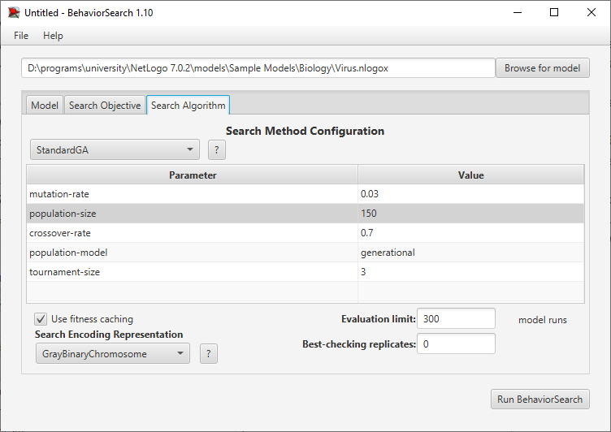
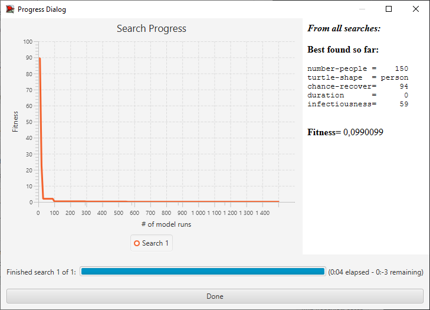
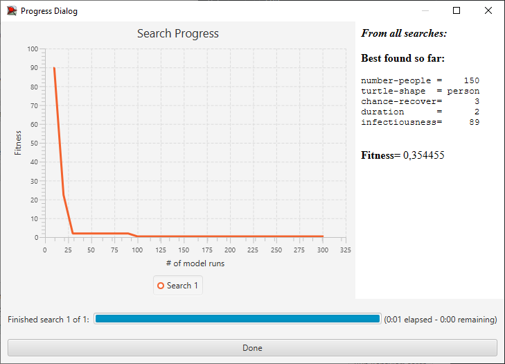

## Комп'ютерні системи імітаційного моделювання
## СПм-24-2, **Бондаренко Сергій Вікторович**
### Лабораторна робота №**3**. Використання засобів обчислювального интелекту для оптимізації імітаційних моделей

---
### Варіант 3, модель у середовищі NetLogo:
[Virus](https://www.netlogoweb.org/launch#https://www.netlogoweb.org/assets/modelslib/Sample%20Models/Biology/Virus.nlogo). Модель поширення захворювання у людській популяції.

---

### Вербальний опис моделі:

Ця модель імітує передачу та поширення вірусу в людській популяції. 
Модель ініціалізується зі 150 людьми, з яких 10 інфіковані. Люди випадковим чином переміщуються світом в одному з трьох станів: здорові, але схильні до інфекції (зелений), хворі та інфекційні (червоний) та здорові та імунні (сірий). Люди можуть померти від інфекції або старості. Коли чисельність популяції падає нижче «вантажопідйомності» середовища (встановленої на рівні 300 у цій моделі), здорові люди можуть мати здорове (але схильне) потомство.

### Керуючі параметри:
- **number-people** визначає початкову кількість людей у середовищі.
- **infectiousness** визначає ймовірність передачі вірусу, коли інфікована та сприйнятлива особи знаходяться в одній зоні.
- **duration** визначає кількість тижнів до того, як інфікована людина помре або одужає.
- **chance-recover** контролює ймовірність того, що інфекція завершиться одужанням/імунітетом.
- **turtle-shape** контролює візуалізацію людей як фігури людей чи кола.

### Внутрішні параметри:
- **sick**. Кількість інфікованих людей.
- **immune**. Кількість імунних людей.
- **healthy**. Кількість сприйнятливих людей.
- **total**. Кількість осіб у загальній популяції.

### Показники роботи системи:
- Сумма сприйнятливих, інфікованих та імунних людей на поточному такті симуляції не може перевищувати загальну.
- Кількості інфікованих та імунних людей зворотно пропорційні.
- **%infected** - відсоток інфікованого населення
- **%immune** - відсоток імунного населення.
- **years** - кількість років, що минули.


### Налаштування середовища BehaviorSearch:
**Обрана модель**:
```
...\NetLogo 7.0.2\models\Sample Models\Biology\Virus.nlogox
```

**Параметри моделі** (вкладка Model):  
*Параметри та їх модливі діапазони були **автоматично** вилучені середовищем BehaviorSearch із вибраної імітаційної моделі, для цього є кнопка «Завантажити діапазони параметрів із інтерфейсу моделі»*:
```
["number-people" 150]
["turtle-shape" "person" "circle"]
["chance-recover" [0 1 99]]
["duration" [0 1 99]]
["infectiousness" [0 1 99]]
```

*Час симуляції даної моделі короткий, то кількість людей була залишена за замовчуванням.*
Використовувана **міра**: 
Для фітнес-функції *(вона ж функція пристосованості або цільова функція)* було обрано **значення кількості інфікованих людей**, вираз для її розрахунку взято з налаштувань графіка аналізованої імітаційної моделі в середовищі NetLogo

та вказано у параметрі "**Measure**":
```
count turtles with [ sick? ]
```

Кількість інфікованих людей повинна враховуватися **в середньому** за весь період симуляції тривалістю 100 тактів (на кожному такті є своє поточне значення кількості інфікованих людей), починаючи з 0 такту симуляції.
Загальний вигляд вкладки налаштувань параметрів моделі:


**Налаштування цільової функції** (вкладка Search Objective):  


**Налаштування алгоритму пошуку** (вкладка Search Algorithm):  



### Результати використання BehaviorSearch:
Діалогове вікно запуску пошуку:


Результат пошуку параметрів імітаційної моделі, використовуючи **генетичний алгоритм**:


Результат пошуку параметрів імітаційної моделі, використовуючи **випадковий пошук**:

